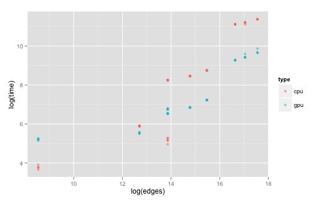

# Our Method

Fetch our method from bitbucket. Please contact Jennifer for password
```
git clone http://ComplexGuest@bitbucket.org/complexcomputation/cpugpu-graph.git
# Enter password here
cd cpugpu-graph
less README.txt
make # may need to modify Makefile depending on your system
unzip data.zip
./pagerank data/t.tsv > output.txt
```

## Run Benchmarks on all graphs
```
#! /usr/bin/env bash

# repeat 5 times or however many replicates
./pagerank c.tsv 2>> out.txt
./pagerank g.tsv 2>> out.txt
./pagerank h.tsv 2>> out.txt
./pagerank m.tsv 2>> out.txt
./pagerank r.tsv 2>> out.txt
./pagerank s.tsv 2>> out.txt
./pagerank t.tsv 2>> out.txt
./pagerank y.tsv 2>> out.txt
./pagerank z.tsv 2>> out.txt
```

Then fetch the benchmark data into a tsv

Perl script
```
#! /usr/bin/env perl

use strict;
use warnings;

my $nodes;
my $edges;
my $cpu;
my $cpu2;
my $threads;
my $gpu;

print "nodes\t";
print "edges\t";
print "type\t";
print "threads\t";
print "time\n";
while(<>){
    if(/(\d+) nodes and (\d+) links/){
        if($nodes){
            print "$nodes\t$edges\t","cpu","\t$threads\t$cpu\n";
            print "$nodes\t$edges\t","gpu","\t$threads\t$gpu\n";
        }
        $nodes=$1;
        $edges=$2;
    }
    if(/use (\d+) threads for multithread CPU computation/){
        $threads=$1;
    }
    if(/CUDA Page Rank calculation totally took (\d+) ms/){
        $gpu=$1;
    }
    if(/Page Rank calculation on CPU took (\d+) ms/){
        $cpu=$1;
    }
    
}
```

Plot the data in R

```
#! /opt/local/bin/Rscript

data<-read.table("gpubench.tsv",sep="\t",header=TRUE)
head(data)
library(ggplot2)
qplot(log(edges),log(time),data=data,colour=type,alpha=I(0.5))
```

